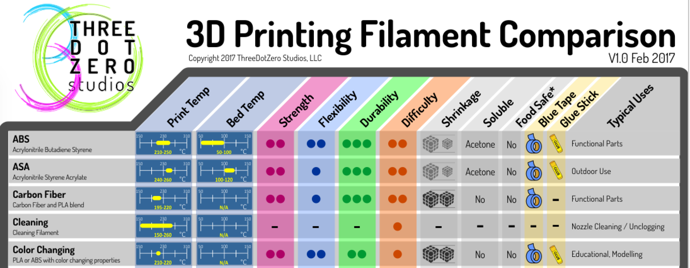
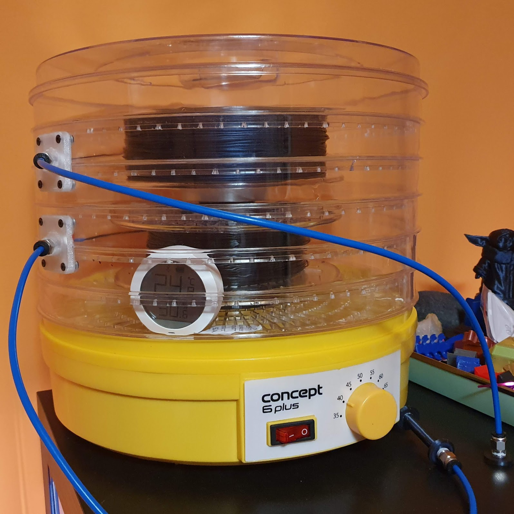

# 3D printing materials

There are many materials that can be 3D printed, even chocolate (I know, right ?).

> [The Chocolate 3D Printer Guide](https://all3dp.com/2/chocolate-3d-printer-all-you-need-to-know/)

But you are not here for the edible content, are you ? So back to our plastics, I found this cheat sheet image online which I keep handy when shopping for materials. Its a good overview of basic properties of each material. Of course, each filament manufacturer adds various mods to the material starting from simple additions like colors to more complex changes that alter the way the material prints, looks or handles stress.

## Water is bad

While each filament is unique they do share common properties with the material types they are advertised to be. And they all have something in common: they are all [hygroscopic](https://en.wikipedia.org/wiki/Hygroscopy). This means that they all **absorb water from the surounding environment**. Once moist enough they become unprintable.

> Importance of dry filaments [WHY you NEED TO DRY your FILAMENTS!](https://youtu.be/FAXUjZZER5E)

While some materials absorb mosture more than others it is still important to keep your spools in sealed plastic bags with [silica gel](https://en.wikipedia.org/wiki/Silica_gel) when not in use. This will prolong the life of filament but it's not bullet proof as the silica gel packs can only do so much. But fear not, you can always dry your filament using your oven, or better yet a cheap food dehydrator.

> Dry your filament: [How to Dry Filament: PLA, ABS, & Nylon](https://all3dp.com/2/how-to-dry-filament-pla-abs-and-nylon/)

I made myself a filament dryer out a the cheapest food dehydrator I could find. It can hold 2 spools and gets the job done when it's needed (albeit a bit noisy). I recommend this over the dry in the oven method as plastics tend to release some gases that can't be healthy over time, and you don't want that mixed in your food, do you now ?

> How to build a filament dryer [Constant Supply Of Dry Filament - Dehydraspool 3D Printing Project](https://youtu.be/p1AQQ41gFDU)

## Buy good quality filaments

Another important characteristic of all filaments you buy is what I like to call **consistency**. This means two things: first of all, the composition (or mix) of the material is the same across the spool and second the diameter is constant. 

As the 3D printer's only measurement is the length of extruded filament, as the diameter changes, so does the volume of extruded material (remember your basic geometry classes ?) leading to uneven layers. And that's not even the worse part, if the filament gets too thick, it can lead to a clogged heatbreak which leats to a lot of downtime and work. On the othere hand, if it gets too thin, the extruder gear will not be able to push it, start skipping and so your print will totally fail.

Bad filament can also contain particles of other materials, like parts of the machine making the filament. Those particles can rub and/or stick against the inside of your nozzle or heatbreak leading to clogs.

This is why it is important to **buy good quality filaments** and not be tempted to go for the cheap ones because plastic is just plastic. A good roll of 750g of PLA starts from $25. If it's cheaper, unless it's a discounted known good brand, avoid buying it.

## Materials for beginers

I started my printing experience with with **PETG**, because it's advertised as being as **easy to print as PLA and as tough as ABS**. Well, that's not really the case and a lot of materials are advertized as such, except it's just marketing as they all print differently and have different properties.

Besides the printing (melting) temperatures recommended by the manufacturer, another important characteristic of various materials is the **glass transition** temperature. It's the temperature at which the material starts to deform. Some materials can be [annealed](https://en.wikipedia.org/wiki/Annealing_(metallurgy)) increasing the strength of the printed part and raising the **glass transition** temperature.

> [Annealing PLA Prints for Strength – 2 Easy Ways](https://all3dp.com/2/annealing-pla-prints-for-strength-easy-ways/)

### PLA

I do recommend that you start with **PLA** as a beginer. **PLA** is very forgiving, can be printed in a **wide range of temperature**, and can even be printed without a heated bed (alto I do not recommend it). It is the **least hygroscopic** of all the materials, making it easy to print even if the spool you got is 2 years old and has not been kept in ideal conditions.

**PLA** is good for **decorative parts**, but because it has **glass transition** temperature of around 55C it is not recomended for **functional parts**. Altho it can be annealed, it still does not compare to other materials specificaly designed for strength and longevity.

**UV light** (like the sun) affects the color and might decompose your prints, so it's a good ideea to keep your prints indoor.

**PLA** is also easy to post process by sanding, painting etc.

**PLA** used to be a low cost material but unfortunately this is not the case, at least in the European Union due to various regulations.

As **PLA** has a wide range of printing temperature, do not be afraid to experiment even above of below the temperatures recommended by the filament manufacturer. I often found some filaments brinted better outside their temperature range.

### PETG

The next material you might be interested in printing is the PET family, most specifically **PETG**. It has a higher **glass transition** temperature of around 75C and improved physical strength compared to PLA.

Printing **PETG** requires higher temperatures than **PLA** and bed adhesion can be more tricky. For me 90-95C on the bed works fine for most of the **PETG** filaments I used, some also work with lower bed temperatures but 90C is a safe bet.

**UV light** resistance is also better for **PETG** so it can be used for outdoor projects.

> [PETG vs PLA: The Differences – Simply Explained](https://all3dp.com/2/petg-vs-pla-3d-printing-filaments-compared/)

### ABS, ASA

While **ABS** and **ASA** offer a very high **glass transition** temperature of over 100C and they are suited for functional parts, they also are more difficult to print. They require higher nozzle and bed temperature and are **very prone to warping** especially on the bed side, deforming the print and losing bed adhesion. An enclosed printer is recommended for this materials because it can keep a more constant temperature thus preventing the print from cooling too fast and warping and also because during the printing process **toxic fumes are released**.

Because they may require printing temperatures above 250C an all metal heatbreak is also required.

> [PLA vs ABS – Filaments for 3D Printing Compared](https://all3dp.com/1/pla-vs-abs-filament-3d-printing/)

> [3D Printing ASA: Best Practices for Optimal Prints](https://all3dp.com/2/3d-printing-asa/)

I do not recommend beginners experimenting with this kind of materials.

### Nylon

For functional parts **nylon** is awesome. It's mechanical properties are are above and beyond but it is very difficult to print on an FFF printer.

First of all, it's very **hygroscopic**. It absorbs water from the surounding air like a sponge, up to 10% of it's weight. In my experience, even out of the box filament cannot be printed without drying it first, which makes a **filament dryer** mandatory.

Second, it warps ... a lot. Besides having a heated bed, **PVA glue** is also required to make the first layer stick to the printing surface. In my experience, even with an **enclosure** and lots of glue, most of the times it was a hit and miss.

Third, it requires higher printing temperatures so an **all metal heatbreak** is mandatory.

> [Nylon 3D Printer Guide: All About 3D Printing Nylon](https://all3dp.com/2/nylon-3d-printing-how-to-get-nylon-3d-printed/)

### Other materials

There are a lot of materials out there with different structural or visual effects. As soon as you master the basics of using **PLA** and **PETG** don't be afraid to experiment with other materials.

**Next step**: [Role of the slicing software](slicer.html)

