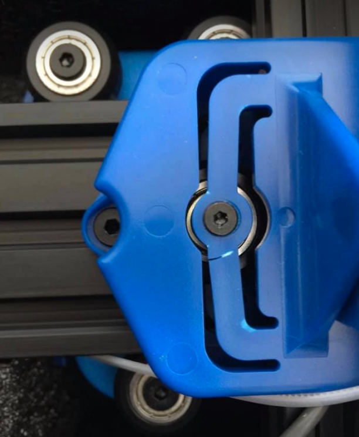
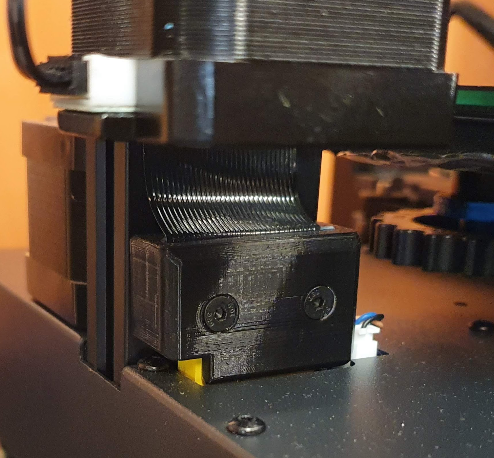
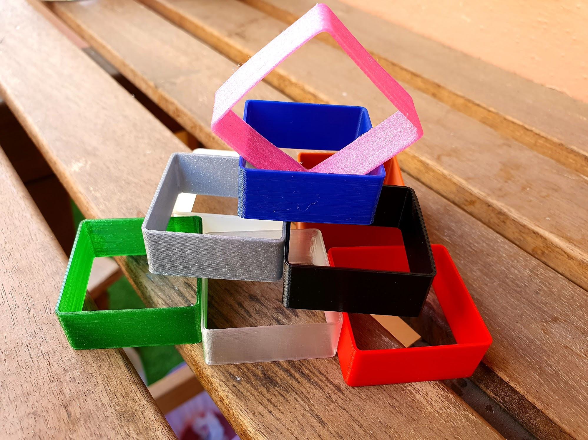
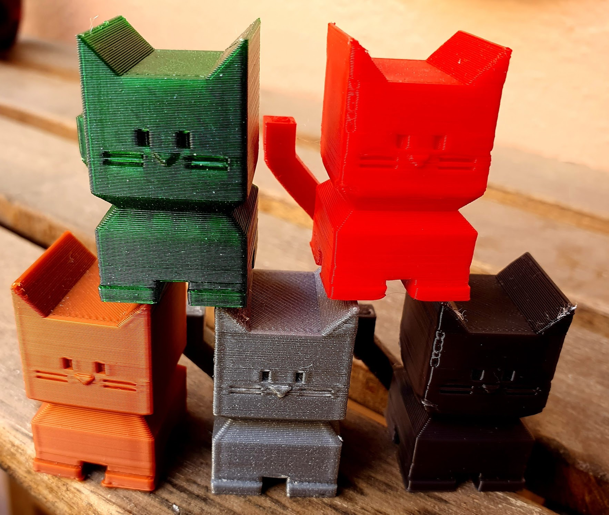
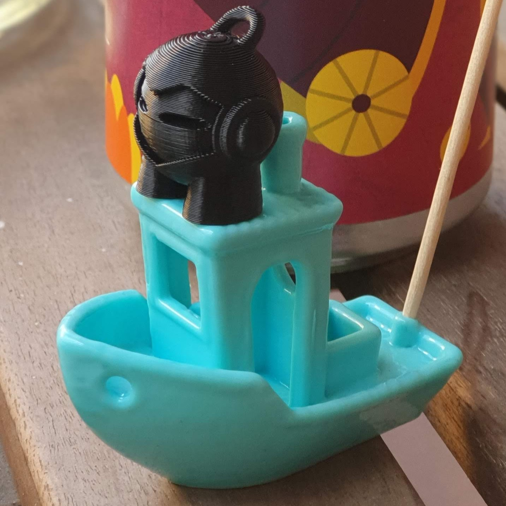

You might be very tempted to quickly unpack and assemble your new printer and start printing. **DON'T JUST YET !**

**Before and during unpacking make sure to take some pictures of the box and of it's contents**. Make sure you have good light and cover most of the angles. In case something might have happend during packing or shipping this will be your proof that it wasn't your fault so it's good that you have the unpacking process documented. Artillery has been very flexible and has never asked for this kind of proof but you never know.

> [How to calibrate 3D printer and first things you should print](https://youtu.be/qddYsbHawno) is an excelent video about the initial setup of your printer. Some things might not apply to Artillery printers (especially the firmware upgrade part) but are good to be aware of.  

> A very good article that covers most of the initial checks you need to perform is [Artillery Sidewinder X1 calibration guide](https://3dprintbeginner.com/artillery-sidewinder-x1-calibration-guide/)

## Assembling your 3D printer

In case of the **Sidewinder** and his little brother the **Genius** this is pretty straight forward. You just need to insert the part holding in Z and X axis into the base of the printer, fix it with the 4 screws and then plug the 4 cables for the Z motors, Z endstop and filament sensor.

**One thing to be careful** with is the plug at the base of the left Z gantry that looks like an [ISA connector](https://en.wikipedia.org/wiki/Industry_Standard_Architecture). If that part is not inserted properly it can create a lot of problems in the future as all the connections for the X motor and the extruder block pass though it. If unsure, you can always loosen the 2 screws holding the connector and pushing it more towards the base of the printer.

### Screws and connections

You have to check that at least **all the visible screws** on the base of the printer and on the Z and X gauntries **are properly tightend** and that none are missing. A missing screw could be hiding between other printer components and jam the mechanisms or create a short circuit.

**Check that all the ribbon cables are properly inserted**. Remove the plastic cover of the extruder block (makes it easier) unplug the ribbon cable and then re-insert it. The other end of this cable did not seem to create issues for anyone so far, but it's worth at least visually inspecting the connector. Do the same (unplug and plug back in) for the ribbon that goes up and down the left Z gantry.

**You can safely leave the filament sensor unplugged**. It's been creating more issues for many people than it solving, so unless you're running a print farm or doing very long prints you're better of without it. Do not remove it as it's good for guiding the filament and making sure your filament does not unravel from the spool, just unplug it.

### Belts and wheels

**Belts need to be properly tight**. You should be able to pinch them almost like a guitar string. Each end of the belt has an idler that is fixed to a piece of metal that in turn is fixed to the gantry with two screws. To tighten the belt, unscrew the two screws, pull the idler assembly and re-tighten the screws. It's a good practice to re-check the belts tension from time to time to make sure they did not get loose.

The wheels that walk the gantries are equiped with eccentric nuts. Because the gantry profile and the wheels are angled this is called a **v-slot** roller system. The eccentric nut allows one of the wheels to move closer or farther from the gantry so that the part that needs to move does not have any play and can freely slide. For the X and Z axis there are 3 wheels hoding each part, with the 2 on one side being fixed and the 3rd on the other side being movable via the eccentric nut (so the one on the bottom for the extruder block and the inner ones for the Z axis holding the X gantry). The Y axis holding the bed on the other hand has four wheels, two on each side and only the ones on the right side have eccentric nuts which you should try to tighten so that both apply the same pressure.

**The wheels need to be tight enough so that the part is not wobbly and only moving in the direction it's supposed to. You should be able to move them by hand and the movement should feel smooth from one end to the other.**

> First time you do this, you might feel two bumps about 1/3rd from the ends of each axis (for the X and Y as for Z you can't really check this). It is normal and it will even out after a few days of printing. This is because the wheels have been tightened and left in the same position for a long time and the rubber has deformed a bit.

In time, the wheels will gather some dust part from your environment and part from the factory coating. **Wipe them with a cloth or a cotton tip from time to time**.

### Z rods

You should **visually inspect the threaded rods and make sure they are straight and properly lubrufiated** from the factory. Idealy you would remove them and roll them on a flat surface to check if they are straight, but this is rather complicated so I suggest you don't do that now.

**Check for spacing between the motor axle and the threaded rod [inside the couplers](img/Genius-z-coupler.png)**. You can try to insert a piece of paper in the gap of the coupler, or use a flashlight from the other side. If there is no gap, you can release the coupler screws, slightly pull the rod and the coupler and insert a piece of plastic about 0.7mm thick to serve as a spacer (*I have used an [iFixit plastic card](https://eustore.ifixit.com/products/plastic-cards) but even a few sheets of paper should work*) then press it all together then tighten the screws and remove the spacer.

**Check that your X gantry is paralel to the base of the printer**. You can use a [spirit level](https://en.wikipedia.org/wiki/Spirit_level) to do that, or some [z-height blocks](https://www.thingiverse.com/thing:3384054) if you have a friend that can print them for you. Basically any tho any 2 identical objects that can fit under the X gantry should do, I have used 2 vitamin containers.

If the X gantry is not paralel to the bed, you need to loosen the syncronization belt pulley screws to make sure both Z motors can move independently, then you can manually turn either one to makes sure the gantry is flush with the spacer objects you have used.

### The extruder block

**Check that the [extruder block looks like in the pictures](img/Genius-extruder-block.png)**. Make sure the heatbreak radiator is properly installed (we have seen them mounted with the fins towards the heatbreak), and also check the extruder hobbed gear is aligned with the idler.

> **It is time to plug in your printer for the first time.**

After you turn on the printer, **make sure the extruder does not start heating**. The screen should indicate the room temperature for both the extruder and the bed. If the extruder temperature goes up turn off your printer imediatly and [contact support](https://desk.zoho.com/portal/evnovo/home?fbclid=IwAR26G4lGDSpWJmn343eco7eDXidDpLRJ0vd-3ccObYjGil2K3cEdL0PperQ). This means the MOSFET on the mainboard is busted, it could be just a bad batch or it could also by a symptom of a more serious issue like the power supply.

Next you need to **make sure that your nozzle is properly tight inside the heatblock** and that it's touching the heatbreak. You should preheat the extruder to 240C and use a caliper and a 7mm wrench to tighten the nozzle, but don't overtighten it as it may cause damage to the heatblock and you can even break the nozzle.

> A good video on how to replace the nozzle is [Artillery 3D Sidewinder X1 Nozzle Changing](https://youtu.be/-zRLtCY5a3o)

## Home your printer

To make sure everything on the mechanical part is ok, it is now time to **home** your printer. From the TFT go to **TOOLS -> HOME** and home one axis at a time so that just in case there is an issue with one you know which one. If all goes well, you now have your extruder in the 0/0/0 position. In case any axis has issues moving, check the conexions, especially the ribbon cables as they are usually to blame. In some rare cases it could be that the motor driver is broken.

Now that your printer knows where 0 is on each axis, go to the **TOOLS -> MOVE** menu and move each axis to make sure the printer is working properly. I suggest to move the Z axis up to the top and back down a coupler of times to make sure the lube on the threaded rods is spread evenly.

To check the extruder motor is also working fine, go to **TOOLS -> HEAT** menu and start heating the extruder to 180C (otherwhise you won't be able to extrude as there is a built in protection). After the extruder reaches the set temperature go to **TOOLS -> EXTRUDE** and play a bit with the IN and OUT to make sure the motor is spinning fine without any filament. If it doesn't, a good culprit for this are the ribbon cables (did you check that they are inserted properly?). In some rare cases it could be that the E motor driver is broken. Don't forget to stop the extruder heating when you are done.

## Calibrating your 3D printer

It is now time to perform some calibrations, so **start by loading your filament**, PLA preffered.

**Connect your 3D printer to a PC** as some of the calibrations require using some sort of terminal (like [Pronterface](https://www.pronterface.com/)) to issue commands to the printer. If you are on Windows you will probably need to install [CH341 serial driver](http://www.wch-ic.com/downloads/CH341SER_EXE.html) for the OS to see your virtual serial port of the printer's mainboard (the driver installer needs to be *Run as Adminstrator*).

Some of the calibration steps and guides require you to **save some settings to EEPROM** so that they persist between printer reboots. Since Artillery Sidewinder and Genius printers come with **EEPROM disabled** you need to put the resulting G-code at the very top of your [slicer's startup script](slicer.html#machine-settings).

### Check extrusion

Preheat your nozzle according to the specs of your material and **extrude some filament** by holding the idler lever and gently pushing the filament in by hand. **The filament should not put much resistance and it should flow straight down**. 

If the filament tends to curl up it could mean that you have a partially clogged nozzle. Try doing a cold pull.

> [How to Clean a 3D Printer Nozzle](https://youtu.be/hBkTeXxcFi8)

If the **filament makes popping sounds** (water quickly evaporating due to the heat and pressure) and the flow is not constant this could mean that your filament is wet and you need to dry it before trying to do anything else.

> [WHY you NEED TO DRY your FILAMENTS!](https://youtu.be/FAXUjZZER5E)

### Extruder screw pressure

Preheat your nozzle according to the specs of your material and extrude some filament from the TFT menu. Then press on the idler lever, remove the filament and check the marks left by the [extruder hobbed gear](img/Genius-extruder-block.png). If the grooves are too deep then you need to release some of the pressure the idler is puttin on the filament by screwing in the idler pressure screw. If there are no grooves the idler needs to apply a bit more pressure. Finding just the right pressure depends on the material, but in general too much pressure will grind the filament and create extrusion problems, too little pressure can make the hoobed gear slip and also grind the filament in time. If you see filament leftovers on the hobbed gear or around it it means your pressure is not propper.

> TODO take a picture of the idler pressure screw and make an orientation diagram

### Extruder steps calibration

This ensures the necessary amount of material is extruded. Since the slicer requires a specific **volume** of material to be extruded to create your model, the only way it can calculate how much is actually extruded is by knowing the **diameter** of the material (which is always the same - 1.75mm in our case) and the **length**. The printer can only work with the length of extruded filament given my the number of steps the extruder motor performs while spinning the hobbed gear used to push in filament. If the motor steps per mm of extruded filament is not setup corectly, then you will have more or less material extruded leading to over or under extrusion.

> [Extruder Calibration Guide (with calculator) – E Step Calibration](https://3dprintbeginner.com/extruder-calibration-guide/)

### Flow rate calibration

More advanced users would like to perform a flow rate calibration. As different materials extrude differently in order to get very acurate dimensions for your prints the flow of each material needs to be adjusted. This is an optional step for now and you can do it later if you are not happy with your results in terms of dimnension accuracy.

> [Flow Rate Calibration – Improve Print Accuracy](https://3dprintbeginner.com/flow-rate-calibration/)

### PID calibration

Another important step in the life of your 3D printer is the **[PID](https://en.wikipedia.org/wiki/PID_controller) calibration** of the extruder and heatbed heaters. Since the heaters are either heating or not heating the printer needs to monitor the temperature and turn them on and off at regular intervals to **maintain a constant temperature** which is very important during 3D printing. And because the CPU has limited resources, it can't always perform this monitoring and calculation and control all the printer's movements at the same time, this is where the **PID calibration** comes into play. By performing a series of cyles of heating, maintaining the temperature constant and then cooling down the printer firmware pre-calculates the on/off cycles of the heater required to maintain a specific temperature so it does not have to perform this computations during printing. 

> [Hotend and Heatbed PID Tuning](https://3dprintbeginner.com/hotend-and-heatbed-pid-tuning/)

## Slicer profile

Now that we made sure the machine is operating properly, it's time to choose a [slicer](slicer) and setup a profile for your printer and material.

Easiest way to get started is with [Prusa Slicer](https://github.com/prusa3d/PrusaSlicer/releases) or [Ultimaker Cura](https://ultimaker.com/software/ultimaker-cura). They both have a similar organisation of settings split into [machine, material and print profiles](slicer#overview-of-slicer-settings). Both do a good job of explaining what each setting does via a tooltip, Cura even has a [settings guide plugin](https://marketplace.ultimaker.com/app/cura/plugins/Ghostkeeper/SettingsGuide2) which explains more in depth what each setting does. They both highlight what changes you made to your settings versus the saved version of each profile and versus the defaults so each time you change something you can easily track those changes.

I got started with **Prusa Slicer** because it felt more solid at that time, coming from the same company that builds the most famous 3D printer of them all, but whichever you choose is fine.

### Pre-made profiles

To get started easier you can download a pre-made profile, this will give you some sensible defaults to get you started and then you can tune your settings from there after you get the hang of it.

**Prusa Slicer**:
> **3dprintbeginner** [Artillery Genius Profile for Simplify3D and Prusa Slicer](https://3dprintbeginner.com/artillery-genius-profile-for-simplify3d-and-prusa-slicer/) - this is the one I got started with.

> **3D-Nexus** [Artillery Sidewinder X1 And Genius: Prusa Slicer Settings Bundle UPDATED](https://3d-nexus.com/newsroom/news-announcements-m/artillery-sidewinder-x1-and-genius-prusa-slicer-settings-bundle-updated)

**Cura**
> **3D-Nexus** [3DN Artillery SWX1 and Genius Cura 4.6.1 Machines and Profiles Installation Package Released!](https://3d-nexus.com/newsroom/news-announcements-m/3dn-artillery-swx1-and-genius-cura-4-6-1-machines-and-profiles-installation-package-released)

### Creating your own profile

Once you understand how the different settings affect your print, you can build your own profile. It's actually easier than you think and the slicer defaults are usually pretty good to begin with, but for now you can skip this part and come back to it later. Here is a list of settings that you should take into consideration:

#### Machine limits
- **print size**: 
  - 220mm on X and Y
  - 240mm on Z (I actually use 220mm for Z because of some constraints of my enclosure)
- **nozzle diameter**: 0.4mm for the default nozzle the printer shipps with
- **max feedrates**:
  - 200mm/s for X and Y
  - 20mm/s for Z
  - 40mm/s for E (extruder)
- **max acceleration**: 
  - 1000mm/s2 for X and Y
  - 100mm/s2 for Z
  - 5000mm/s2 for E 
- **max jerk**:
  - 7mm/s for X and Y
  - 0.20mm/s for Z
  - 2.5mm/s for E

#### Material settings  

Those will depend on the material you are printing, always check the specifications provided by the manufacturer. 

- **temperature** - start in the middle of the temperature range of the filament, check the results and go from there.
- **bed temperature** - start with the manufacturer recommended value. If the prints tend not to stick to the bed you can always increase in 5C increments and use a different value for the first layer(s).
- **retraction** - usually the recommended vaules are for Bowden style extruders so they are usually too high for the direct drive setup used on Artillery printers. I use a retraction distance between 2mm and 3mm with a speed of 40mm/s. I also enable z-hop (or lift Z) during retraction with a distance of 0.5mm to 1mm depending on the results observed.
- **cooling** - For most PLA cooling needs to be on all the time at 100% except for the first 2-3 layers to help with the bed adhesion. PETG prefferes less cooling so I drop it to about 50% max. ABS and ASA use even less or no cooling at all. 
- **linear advance** will be filament specific, use Marlin's [K-factor Calibration Pattern](https://marlinfw.org/tools/lin_advance/k-factor.html) to tune your value. ***Note that linear advance is not enabled on the default Artillery firmware***.

#### Print settings

- **layer height** should be set between **0.1mm** and **0.3mm** depending on the resolution you want. The minimum layer height mostly depends on your material while the maximum layer height is **75% of your nozzle diameter**. You can also set a different larger height for the first layer to increase bed adhesion (but not above the maximum computed from your nozzle).
- **line width** is based on the nozzle size, I found out that using a slightly larger value like 0.45mm for the default 0.4mm nozzle gives better results in terms of quality and also speeds up printing times.
- **shell thinkness/wall count** - depending on your model and how tough you want your print to be. 3 walls (or 1.35mm at 0.45mm line width) provide a decent compromise between strength and speed.
- **infill** percentage is recommended to be in the **5-20%** range and for infill pattern I usually use Gyroid as it's a good compromise between strength, speed and aspect (if you use some transparent or translucent material). Above 20% it does not make any sense to use as it won't provide significant additional strength to the model but will add a lot of printing time.
- **supports** in case your part needs them, I recommend trying out the [experimental tree supports](https://support.ultimaker.com/hc/en-us/articles/360012614559-Experimental-settings) in Cura.
- **speed**
  - a good default is between **50-60mm/s** for most materials
  - lower the speed to **20-30mm/s** for the first layer to get good bed adhesion
  - lower the speed for bridges to about the same as the first layer (in **Cura** you have to **Enable Bridge Settings**) for best results
- **acceleration** for X and Y
  - a value of **500mm/s2** for print moves gives the best results in terms of quality, but it does increase the printing time
  - **800mm/s2** is a good compromise between quality and speed
  - going up to **1000mm/s2** is possible but imperfection will start to appear depending on what you are printing
- **jerk** - the defaults from machine settings should work fine.
- a **skirt** can provide better adhesion.
- the **brim** helps with purging the old material from the nozzle at the begining of your print. I personally don't like it because the gap in the filament caused by the oozing from the previous print can make bumps in the brim extrusion which will sometime cause the brim to stick to the nozzle and get dragged all over the first layer of your print. I like to do my purging at the edge of the bed to be sure it does not interfere with the actual print.

## Bed leveling

Now that you have checked all the mechanical, part of the electronical and you got your slicer profile installed, it's time to perform your first bed leveling.

> I'm not going to write yet another tutorial on this topic, just follow the guide: [Best method for 3D printer bed levelling](https://youtu.be/RZRY6kunAvs)

In case you don't manage to get all the leveling squares print the same, your bed might be bent (usually towards the middle) and you have to ask for a replacement. You can also confirm this with a flashlight and a ruler placed against the bed surface.

## Your first real print

**Congratulations, you should now have a working printer and you can start fine tunning your slicer settings to get most out of it !**

With every new material I get, my **first print** is usually a [35x35 calibration square](https://www.thingiverse.com/thing:3397997) printed at 0.2mm layer height and 2 walls to test various printing temperatures on it. You can also use a brim if you can't get it to stick to the bed. You could also do a temperature tower but that takes way longer. Start with a temperature in the middle of the range recommended by the filament manufacturer and go up and down until you like the result. You should feel the layers with your fingernail (so they should not feel melted onto each other) but they should not be too easy to split from each other either (try bending the cube's margins along the layer lines or inserting your fingernail between the layers).

Next thing I usually print is [calicat](https://www.thingiverse.com/thing:1545913) as it's more exciting than the usual calibration cube. Plus you can build yourself a calicat army or give them to your friends once they start filling up your room like little lego pieces.

## Your first useful print(s)

Now that you got your first material tunned in you should definately print a **strain relief for the bed cable** as it's prety fragile.

> [Artillery Genius Bed Cable Strain Relief](https://www.thingiverse.com/thing:4056229) by fritz11 is the one I use.

2nd most useful print is a **cable relief for the ribbon** going to the extruder as it moves a lot and has a tendency to get unplugged.

> I use the [Artillery Genius cable relief with cable insert slot](https://www.thingiverse.com/thing:4213436) by galimpic but there are also other versions out there.

3rd print should be a **dust filter** for your filament. For that you also need a piece of a clean dishwater sponge.

> I use the [Filament Dust Filter](https://www.thingiverse.com/thing:190118) by sneakypoo

___
You can no go ahead and print that Benchy you always wanted.

*(Benchy printed in [Polymaker's Polysmooth](https://eu.polymaker.com/product/polysmooth/))*

**Next step**: [Tips and tricks](tips.html)

